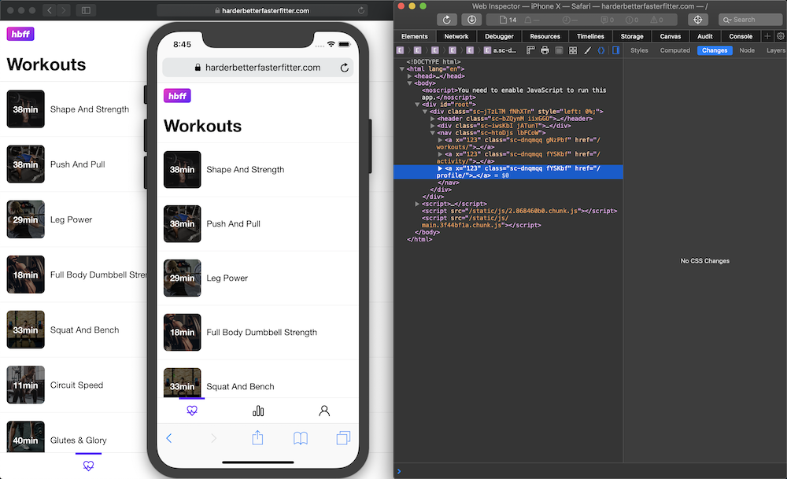

Apple's support for Progressive Web Apps has improved a lot in recent years. An add-to-home-screen button, splash screens, local storage, service workers, and full-screen options, all help bring iOS up to par with Android. In order to test your site with some of these features on various screens and devices, you don't need to own all of apple's devices. Apple gives us a way to run all their devices from our desktop: XCode. Let's see how to get up and running to test a website in safari.

XCode is a bit of beast and can be intimidating when you first start. We can use it to access the device simulator. We can also connect our simulator to safari dev tools to inspect elements. Try this:

1. Start XCode.
1. From the `XCode` menu, go to `Open Developer Tool` -> `Simulator`.
1. When the simulator opens, from the menu, select you device. `hardware` -> `device` -> `iOS` -> `iPhoneX`.
1. Open safari on the simulator _and_ on your desktop.
1. Naviagate to the page you want to test in desktop safari.
1. After the page loads, from desktop safari, select `File` -> `Share` -> `Simulator`. Click send when the dialog appears.
1. To open the web inspector, from desktop safari menu, select `Develop` -> `Simulator` -> `yoursite.com`.

Done! You can now view source, network, the debugger and all the tools available for desktop development.

